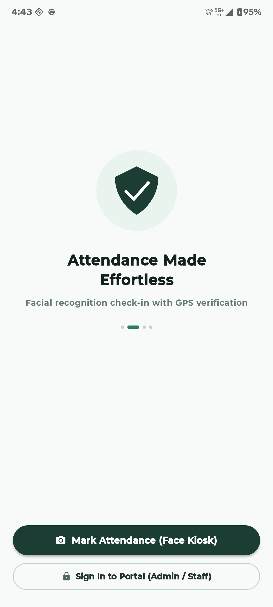
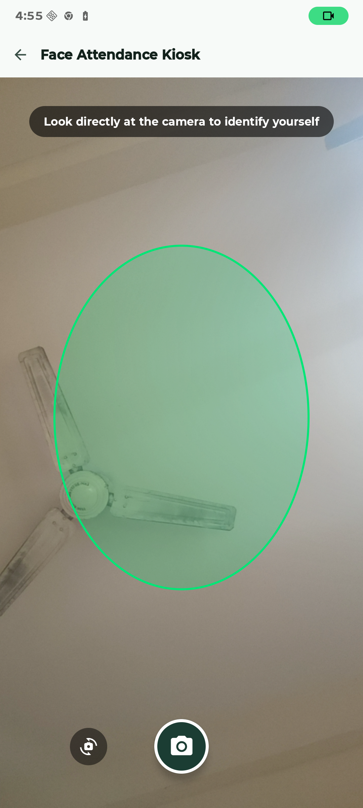
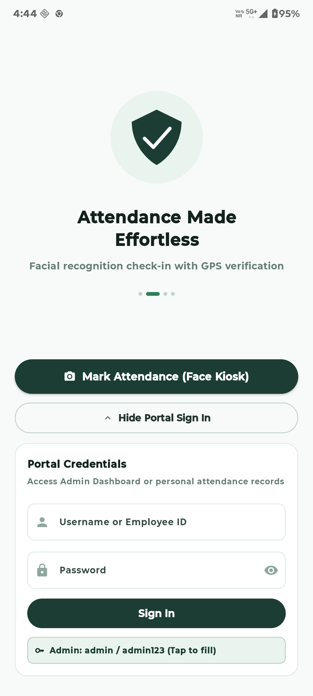
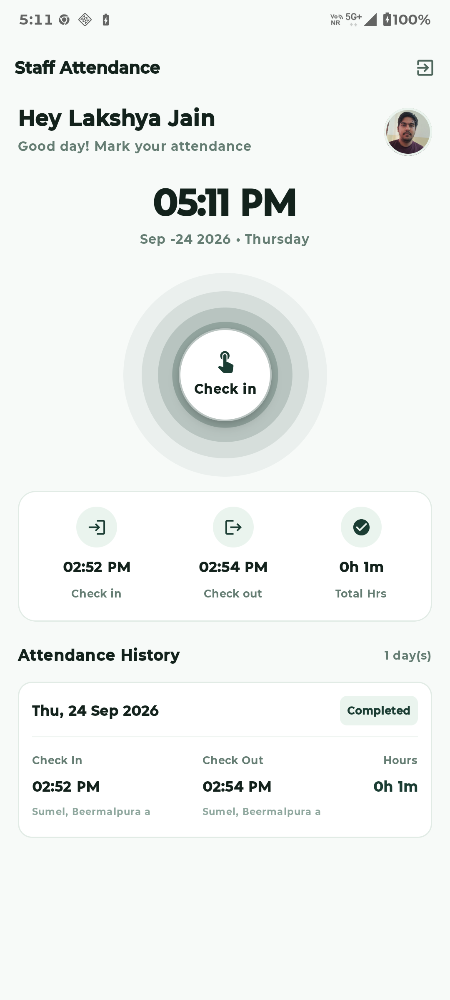
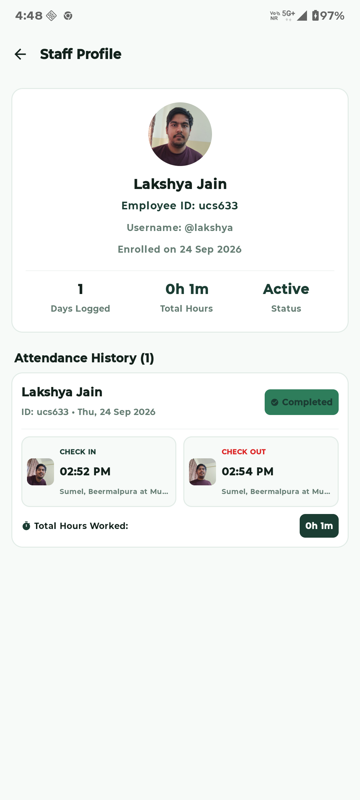
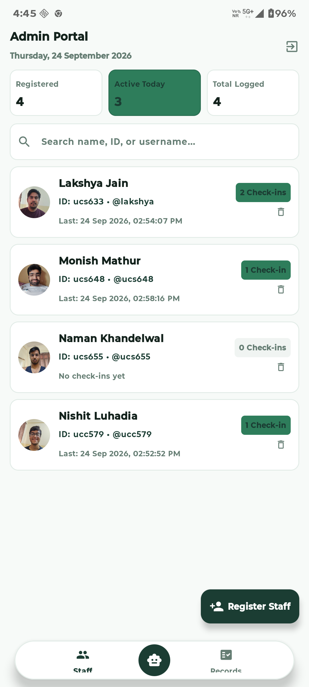
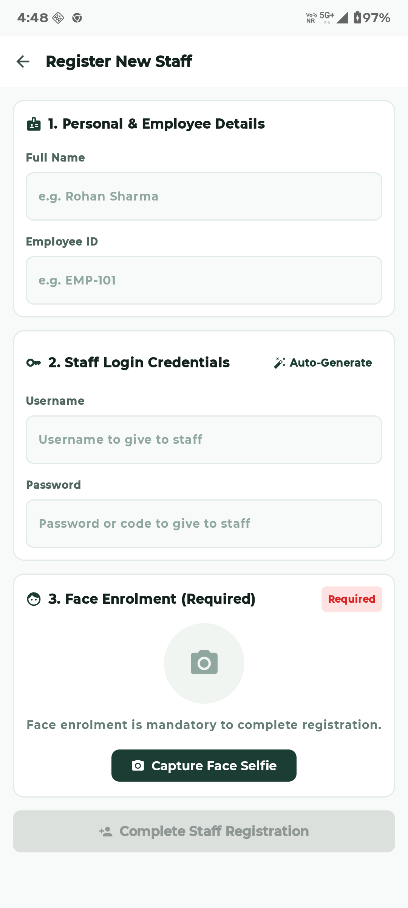
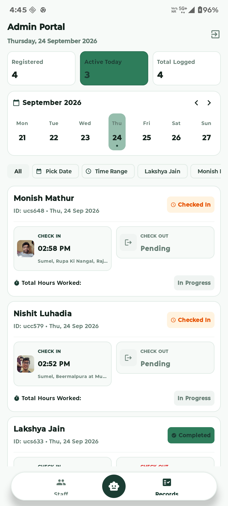
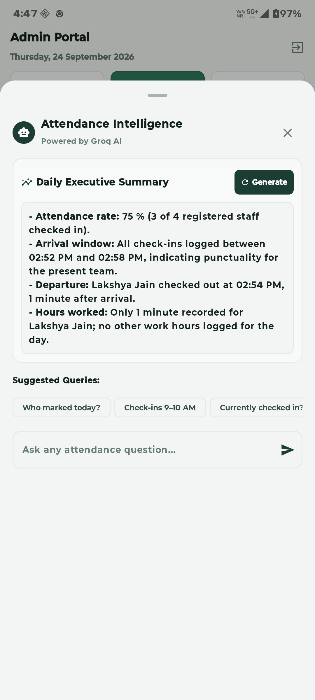
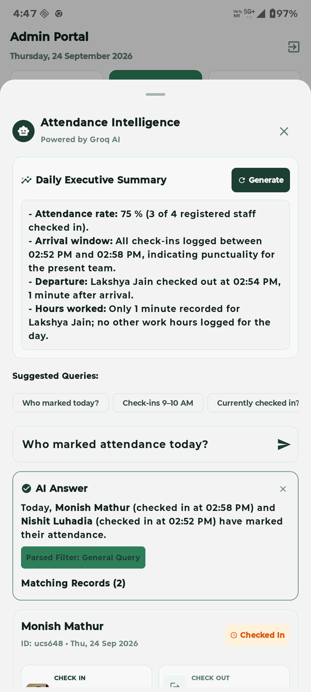

# Smart Attendance App — 1:N Facial Kiosk, Admin Portal & Groq AI Assistant

An enterprise-ready Android attendance system built with **Kotlin** and **Jetpack Compose (Material 3)**, featuring a modern **Forest Green & Soft Off-White** UI, on-device **1:N Face Recognition** using TensorFlow Lite & Google ML Kit, **CameraX** live selfie capture, **GPS Geolocation** verification, **Check-In / Check-Out Hours Tracking**, local **Room SQLite** persistence, and an intelligent **Groq Cloud AI Assistant** (`openai/gpt-oss-20b` & `llama-3.3-70b`) for natural-language aggregate queries and executive summaries.

---

## 📦 Submission Deliverables

As required by the Hiring Assignment guidelines:
1. **GitHub Repository**: [`https://github.com/namankhandelwal1607/Android-Attendance-App`](https://github.com/namankhandelwal1607/Android-Attendance-App)
2. **Pre-built APK**: `AttendanceApp.apk` (located at project root and committed to the repository)
3. **Comprehensive README**: Architecture, setup instructions, assumptions & limitations, demo credentials, and test scripts (detailed below)
4. **AI Pair Programming Conversation Export**: `ai_conversation_export.json` (955 messages capturing the complete end-to-end design, code generation, debugging, and deployment workflow)

---

## 📱 Application Screenshots & User Flows

The following high-resolution screenshots were captured directly on a live physical device (**Motorola Edge 50 Fusion**, Android 14) showcasing the complete end-to-end working experience across both **User (Staff)** and **Admin** portals, the on-device 1:N facial kiosk, and the Groq AI engine.

### 1. 🚀 Onboarding & 1:N Facial Attendance Kiosk
| Landing / Onboarding | 1:N Facial Kiosk (CameraX) | Expandable Portal Login |
| :---: | :---: | :---: |
|  |  |  |
| *Forest green theme, shield logo, Face Kiosk shortcut* | *Real-time CameraX preview with oval face alignment* | *Expandable credentials card with quick-fill* |

### 2. 👤 Staff Member Portal (User Flow)
| Personal Dashboard & Live Clock | Detailed Attendance Profile & History |
| :---: | :---: |
|  |  |
| *Personal greeting, bold live clock, concentric ring check-in/out, and real-time stat tiles* | *Days logged, total hours, paired check-in & check-out history with GPS address and thumbnails* |

### 3. 🛡️ Admin Portal & Staff Registration
| Staff Directory & Real-Time Stats | Register New Staff Member |
| :---: | :---: |
|  |  |
| *Live counters (Registered, Active Today, Total Logged), instant search, and staff cards* | *Name, Employee ID, auto-generated credentials, and facial biometric enrolment guide* |

### 4. 📊 Paired Records & Weekly Calendar Navigation
| Paired Check-In / Check-Out Records with Date Strip |
| :---: |
|  |
| *September 2026 Weekly Date Strip, filter chips, paired records with GPS location tags and total hours worked* |

### 5. 🧠 Groq Cloud AI Assistant (Natural Language & Analytics)
| Real-Time Daily Executive Summary | 0-Hallucination Query Engine ("Who marked attendance today?") |
| :---: | :---: |
|  |  |
| *Instant one-tap breakdown: attendance rate (75%), arrival windows, and punctuality* | *Accurate natural language response verified against local Room SQLite database* |

---

## 🎨 UI Design System (Forest Green & Soft White Palette)

- **Palette**: Dark Forest Green (`#1B3D33`) as primary brand accent, Soft Off-White (`#F7FAF8`) background, Card White (`#FFFFFF`), and Mint accents (`#D9E8E1`).
- **Screen 1 — Landing / Onboarding**:
  - Shield + Clock + Checkmark brand logo.
  - Heading *"Attendance Made Effortless"*.
  - Prominent pill action: **"📷 Mark Attendance (Face Kiosk)"**.
  - Collapsible portal sign-in card with quick-fill credentials for Admin (`admin` / `admin123`).
- **Screen 2 — Live Clock & Concentric Ring Check-In / Out**:
  - Greeting header: *"Hey [Staff Name]"*.
  - Big live digital clock display (`09:00 AM` style).
  - Circular **concentric-ring button** with multi-layer pulsing waves for Check In and Check Out.
  - Three real-time stat tiles: **Check in** time, **Check out** time, and **Total Hrs** worked.
- **Screen 3 — Weekly Date Strip & Records**:
  - Mon–Sun horizontal calendar strip with selected day highlight in Forest Green.
  - Paired check-in and check-out rows with total hours calculation.
  - Material 3 Calendar DatePicker & TimePicker range dialogs.
- **Pill Bottom Navigation Bar & Centered Floating AI Assistant**:
  - Floating pill navigation bar at the bottom.
  - Center floating action button (FAB) with robot/chat icon that opens the **Groq AI Assistant Sheet**.

---

## ⏱️ Check-In / Check-Out & Total Hours Logic

1. **Daily Action Types**:
   - `CHECK_IN`: Records staff arrival with selfie, timestamp, and GPS address.
   - `CHECK_OUT`: Pairs with today's open check-in, records departure selfie, and calculates total hours worked:
     $$\text{hoursWorked} = \frac{\text{checkOutTimestamp} - \text{checkInTimestamp}}{3{,}600{,}000}$$
2. **Kiosk & Staff Flow Validation**:
   - **Prevent Double Check-In**: A staff member who is already checked in cannot check in again today without checking out first.
   - **Prevent Premature Check-Out**: A staff member cannot check out if they haven't checked in today.
3. **Paired Attendance Presentation**:
   - Both Admin and Staff screens display paired attendance blocks showing Check-In time, Check-Out time (or *"Pending"*), locations, thumbnails, and total formatted hours (e.g., `8h 15m`).

---

## 🤖 Multi-Intent Groq AI Assistant Architecture

To ensure **0% hallucination** on times, dates, and attendance counts, the AI Assistant uses a **Two-Step Architecture**:

```
┌──────────────────────────────────────────────────────────┐
│                   User Asks Question                     │
│       "Who checked in between 9 and 10 AM today?"         │
└────────────────────────────┬─────────────────────────────┘
                             │
                             ▼
┌──────────────────────────────────────────────────────────┐
│              Step 1: Intent & Filter Parsing             │
│        (Groq Cloud: openai/gpt-oss-20b JSON schema)       │
│  Outputs: intent = "FILTER_RECORDS", timeFrom = "09:00",  │
│           timeTo = "10:00", dateFrom = "2026-09-24"      │
└────────────────────────────┬─────────────────────────────┘
                             │
                             ▼
┌──────────────────────────────────────────────────────────┐
│           Step 2: Local SQLite (Room) Execution          │
│   Runs minute-based comparison & exact database counts.   │
│   Verified result: 2 records (Alice at 09:12, Bob at 09:40)│
└────────────────────────────┬─────────────────────────────┘
                             │
                             ▼
┌──────────────────────────────────────────────────────────┐
│              Step 3: Natural Language Response           │
│   Sends verified numbers to Groq to phrase crisp answer. │
│   "2 staff checked in: Alice (09:12 AM) & Bob (09:40 AM)"│
└──────────────────────────────────────────────────────────┘
```

### Supported Intent Types:
- `COUNT_STAFF`: *"How many staff are registered in the system?"*
- `CURRENTLY_CHECKED_IN`: *"Who is currently checked in right now?"*
- `CHECKED_OUT_TODAY`: *"Who has checked out today?"*
- `HOURS_WORKED_TODAY`: *"How many hours did Alice work today?"*
- `GENERAL_STATS`: *"Give me an attendance breakdown for today"*
- `FILTER_RECORDS`: *"Show me check-ins between 9 and 10 AM"*
- `CLARIFY`: Handles ambiguous queries (e.g. *"Show attendance"* without date/staff) by asking clarifying questions.

### Sample Test Queries:
1. `Who marked attendance today?`
2. `Who checked in between 9 and 10 AM?`
3. `How many staff are registered?`
4. `Who is currently checked in?`
5. `Show attendance for this week`
6. `How many hours did Alice work today?`

---

## 🔑 Demo Credentials

| Role | Username / ID | Password | Access Scope & Notes |
| :--- | :--- | :--- | :--- |
| **Admin** | `admin` | `admin123` | Full administrative control: staff directory, enrollment, paired records, and Groq AI assistant. |
| **Staff (Lakshya Jain)** | `ucs633` *(or `lakshya`)* | `123` | Personal staff dashboard: live clock, concentric check-in/out button, and personal history. |
| **Staff (Monish Mathur)** | `ucs648` | `123` | Enrolled staff account with check-in records. |
| **Staff (Nishit Luhadia)** | `ucc579` | `123` | Enrolled staff account with check-in records. |
| **Staff (Naman Khandelwal)** | `ucs655` | `123` | Enrolled staff account. |

> **Note**: Facial Attendance Kiosk (**"📷 Mark Attendance (Face Kiosk)"**) does **not** require typing any credentials. Staff members simply stand in front of the camera to be identified automatically (1:N face matching with $\ge 70\%$ cosine similarity).

---

## 🎬 End-to-End Demo Script

### Step 1: Register a Staff Member
1. Log in with Admin credentials (`admin` / `admin123`).
2. Tap the **"+ Register Staff"** button.
3. Enter Name: `Rohan Sharma`, Employee ID: `EMP-101`.
4. Tap **"Auto-Generate"** to create a username and password.
5. Capture a face selfie inside the oval guide and tap **"Complete Staff Registration"**.

### Step 2: Mark Check-In via Face Kiosk
1. Return to the landing screen and tap **"Mark Attendance (Face Kiosk)"**.
2. Face the front camera and select **"Check In"**.
3. Tap the **concentric-ring button** to verify face similarity ($\ge 70\%$).
4. System greets: *"Checked in successfully!"* with timestamp and GPS address.

### Step 3: Mark Check-Out
1. Return to the kiosk or log in to Staff Portal.
2. Select **"Check Out"** and tap the concentric button.
3. System records Check Out and calculates total hours worked.

### Step 4: Admin Portal & Floating AI Assistant
1. Log back in as Admin.
2. Navigate to **Records** to see the paired row (Check In + Check Out + Hours Worked).
3. Use the **Weekly Date Strip** to filter records by any day of the week.
4. Tap the **Center Robot/Chat FAB** to open the AI Assistant Sheet:
   - Tap **"Generate"** under Daily Executive Summary.
   - Or ask: *"Who checked in between 9 and 10 AM?"* or *"Who is currently checked in?"*.

---

## 🛠️ Architecture & Tech Stack

| Component | Technology | Description |
| :--- | :--- | :--- |
| **Language & UI** | Kotlin 1.9.24 + Jetpack Compose (Material 3) | Declarative UI matching the forest green design system. |
| **Camera** | AndroidX CameraX (`1.3.3`) | Lifecycle-aware selfie capture with oval guidance. |
| **Face Detection** | Google ML Kit Face Detection (`16.1.6`) | Fast bounding-box detection, face centering, and validation. |
| **Face Recognition** | TensorFlow Lite (`2.14.0`) + MobileFaceNet | 192-d L2-normalized face embeddings compared via 1:N Cosine Similarity ($\ge 0.70$). |
| **Database** | AndroidX Room (`2.6.1`) | Local SQLite persistence with paired check-in/check-out records & migrations. |
| **Geolocation** | Google Play Services Location (`21.2.0`) | GPS coordinates (`FusedLocationProviderClient`) + Geocoder address lookup. |
| **AI Layer** | Groq Cloud (`openai/gpt-oss-20b`, `llama-3.3-70b`) | Two-step query classification, Room query execution, and natural response phrasing. |
| **Image Loading** | Coil Compose (`2.6.0`) | Image loading for selfie thumbnails and enrolled staff photos. |

---

## 📌 Assumptions & Limitations

### Assumptions:
1. **Device Hardware**: The device has a front-facing camera for capturing selfies and face embeddings, and hardware location services (GPS) enabled.
2. **Face Match Threshold**: A cosine similarity threshold of $\ge 0.70$ (70%) is used for 1:N identification. This provides a balance between false positives (imposters) and false negatives (lighting variations).
3. **Role Architecture**: The initial state contains a single administrative user (`admin` / `admin123`). Staff accounts cannot be self-registered; they must be enrolled with facial biometrics by an Admin to preserve attendance integrity.
4. **Offline Resilience**: All core attendance functions (face recognition, kiosk check-in/out, local records view) work completely offline using on-device TFLite models and Room SQLite. Geocoding and Groq AI queries will use an offline heuristic fallback when network connectivity is unavailable.

### Limitations:
1. **Extreme Lighting & Angles**: On-device MobileFaceNet requires reasonable ambient lighting and relatively direct face orientation ($\pm 15^\circ$ pitch/yaw) within the oval guide for optimal embedding quality.
2. **Google Play Services**: GPS geolocation and reverse geocoding rely on Google Play Services Location API; emulator instances or custom ROMs without Play Services will fallback to generic coordinates.
3. **Groq API Rate Limits**: Cloud AI queries depend on Groq API quota. If the API key is rate-limited or unavailable, the query agent transparently switches to the local SQLite filter engine.

---

## 🚀 Installation & Running

### Option A: Install via ADB on Connected Device (Quickest)
```bash
adb install -r AttendanceApp.apk
adb shell am start -n com.attendance.app/.MainActivity
```

### Option B: Build from Source
```bash
# Build debug APK
./gradlew assembleDebug

# Install on connected device
adb install -r AttendanceApp.apk
```
